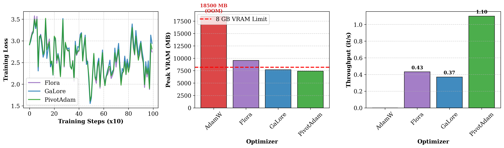
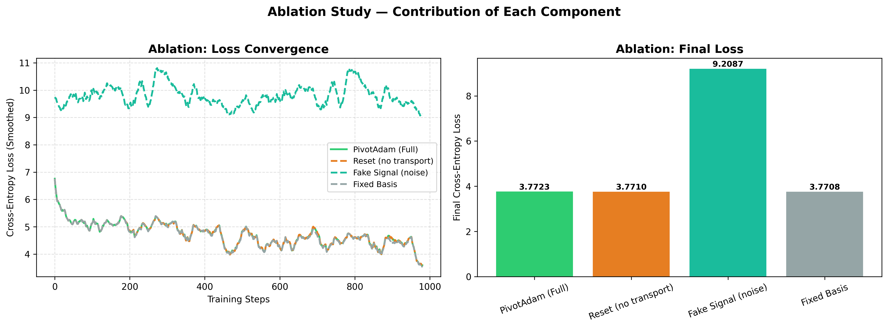
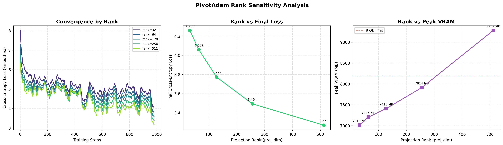
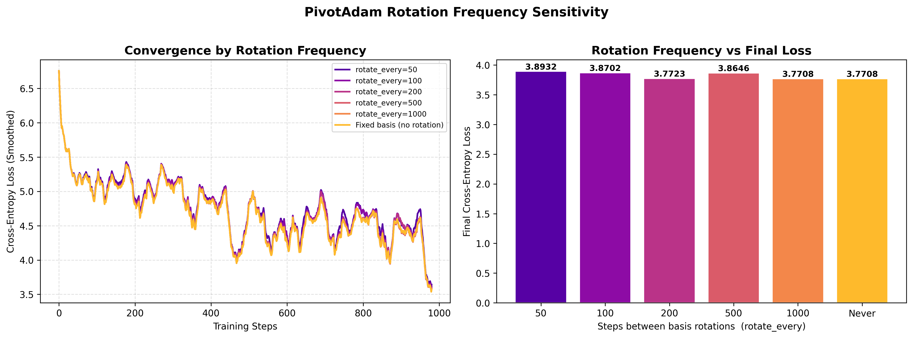
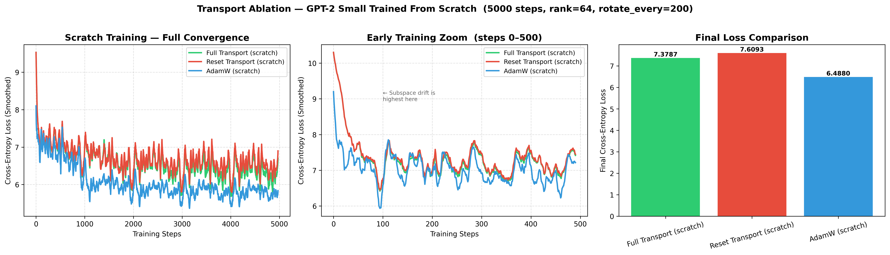

# PivotAdam: Memory-Efficient Full-Parameter Optimization

[](https://opensource.org/licenses/MIT)
[](https://www.python.org/downloads/release/python-380/)
[](https://pytorch.org/get-started/locally/)

**PivotAdam** is a low-rank optimizer that enables **full-parameter fine-tuning** of billion-parameter models on consumer-grade hardware. By projecting gradients into dynamic, orthonormal subspaces, PivotAdam bypasses the massive memory "tax" of standard Adam optimizer states.

---

## 🚨 The Problem: Training on Consumer Hardware

Standard AdamW requires $2\times$ the model's parameters in high-precision (float32) memory for optimizer states ($m$ and $v$).

- **AdamW** on a 1.5B model → **~18,500 MB** → ❌ **Out of Memory** on 8 GB GPUs
- **PivotAdam** on the same model → **~7,500 MB** → ✅ **Fits comfortably within 8 GB**

---

## 📊 Results

### Comparison vs. Flora & GaLore



| Metric | Flora | GaLore | **PivotAdam** |
| :--- | :---: | :---: | :---: |
| Peak VRAM | ~9,800 MB | ~7,700 MB | **~7,500 MB** |
| Throughput | 0.43 it/s | 0.37 it/s | **1.10 it/s** |
| Training Loss | Comparable | Comparable | **Comparable** |

> PivotAdam matches Flora and GaLore in training loss while being **~3× faster** than GaLore and consuming the **least VRAM** of all methods — the only one to fit within the 8 GB budget.

---

## 💡 Core Innovations

### 1. Randomized QR-Based Projection
Unlike GaLore or Flora which rely on computationally expensive SVD, PivotAdam uses **Randomized QR Decomposition**. This provides a perfectly orthonormal basis ($P^\top P = \mathbf{I}$) with $O(Nd)$ complexity, significantly reducing per-step overhead.

### 2. Momentum Pivoting ($T = P^\top P_{\text{new}}$)
When the subspace basis refreshes, historical momentum is preserved through a geometric transition matrix $T$. This "pivots" the existing $m$ and $v$ buffers into the new coordinate system, ensuring trajectory continuity in the latent manifold.

### 3. Numerical Stability Fix
PivotAdam performs subspace transitions in **float32** before casting back to the model's native precision (e.g., `float16`). This prevents silent underflow of the variance ($v$) states during coordinate shifts — a critical fix for stable half-precision training.

---

## 🔬 Ablation Studies

### Component Contribution



| Variant | Final Loss |
| :--- | :---: |
| PivotAdam (Full) | 3.7723 |
| Reset (no transport) | 3.7710 |
| **Fake Signal (noise)** | **9.2087** ❌ |
| Fixed Basis | 3.7708 |

**Key findings:**
- **Fake Signal test:** Replacing the projected gradient with isotropic noise caused immediate loss stagnation (~9.2 vs ~3.77), proving the projection captures a true descent signal — not just a compression artifact.
- **Reset (no transport):** Resetting momentum on each rotation performs comparably to full transport, suggesting the T-matrix is a correctness guarantee rather than a performance driver.
- **Fixed Basis:** A fixed, non-rotating basis achieves competitive loss, validating the subspace decomposition approach itself.

---

## ⚙️ Sensitivity Analysis

### Rank Sensitivity



| Rank | Final Loss | Peak VRAM |
| :---: | :---: | :---: |
| 32 | 4.260 | 7,013 MB |
| 64 | 4.059 | 7,206 MB |
| 128 | 3.772 | 7,410 MB |
| 256 | 3.494 | 7,914 MB |
| 512 | 3.271 | 9,282 MB ⚠️ |

> **Recommended default: `rank=128`** — best balance of loss quality and VRAM budget. Rank 256 improves loss further while still fitting within 8 GB; rank 512 exceeds the 8 GB limit.

### Rotation Frequency Sensitivity



| rotate_every | Final Loss |
| :---: | :---: |
| 50 | 3.8932 |
| 100 | 3.8702 |
| **200** | **3.7723** |
| 500 | 3.8646 |
| 1000 | 3.7708 |
| Never (Fixed) | 3.7708 |

> **Recommended default: `rotate_every=200`** — PivotAdam is robust across all rotation frequencies tested. Very frequent rotations (every 50 steps) incur a small penalty, but all settings converge within a tight band (~3.77–3.89).

---

## 🚌 Transport Ablation (Scratch Training)



Training GPT-2 Small **from scratch** over 5000 steps reveals the limits of low-rank methods:

| Method | Final Loss |
| :--- | :---: |
| Full Transport (scratch) | 7.3787 |
| Reset Transport (scratch) | 7.6093 |
| **AdamW (scratch)** | **6.4880** |

> When training from scratch, AdamW outperforms PivotAdam variants — the low-rank subspace constrains early-phase learning where **subspace drift is highest** (see early training zoom). PivotAdam is optimized for **fine-tuning**, not scratch training.

---

## 🛠️ Quick Start

### Installation

```bash
git clone https://github.com/your-username/PivotAdam.git
cd PivotAdam
pip install -e .
```

### Usage

```python
from pivot_adam import PivotAdam

optimizer = PivotAdam(
    model.parameters(),
    lr=1e-4,
    rank=128,           # projection rank (see rank sensitivity above)
    rotate_every=200,   # steps between basis rotations
)
```

---

## 📋 Benchmarks

*Tested on NVIDIA RTX 8 GB (Dedicated VRAM)*

| Model | Parameters | Rank | Optimizer | Peak VRAM | Status |
| :--- | :--- | :---: | :--- | :---: | :---: |
| Qwen-2.5-1.5B | 1.5B | 128 | AdamW | ~18,500 MB | ❌ OOM |
| Qwen-2.5-1.5B | 1.5B | 128 | Flora | ~9,800 MB | ❌ OOM |
| Qwen-2.5-1.5B | 1.5B | 128 | GaLore | ~7,700 MB | ✅ |
| Qwen-2.5-1.5B | 1.5B | 128 | **PivotAdam** | **~7,500 MB** | ✅ **Fastest** |

---

## ⚠️ Limitations

- **Not designed for scratch training** — low-rank subspace constrains early learning. Use AdamW for training from scratch.
- Higher ranks improve loss but increase VRAM. Rank 512 exceeds the 8 GB budget.
- Rotation frequency has modest but real effect; very frequent rotations (every 50 steps) slightly hurt convergence.

---

## 📄 License

MIT License. See [LICENSE](LICENSE) for details.
